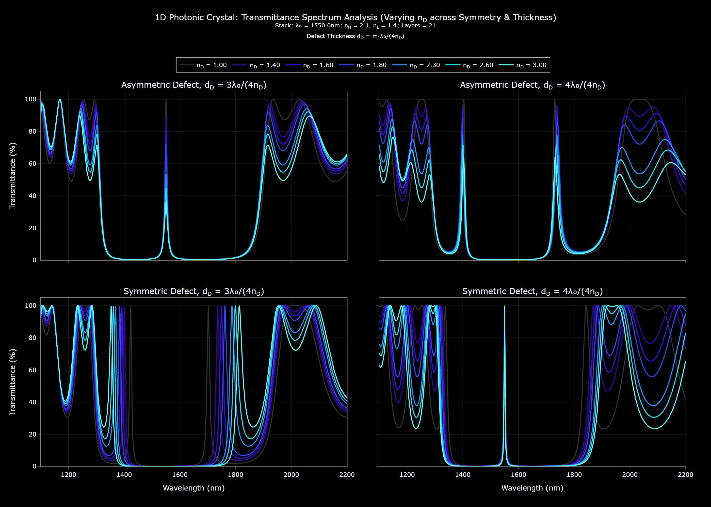
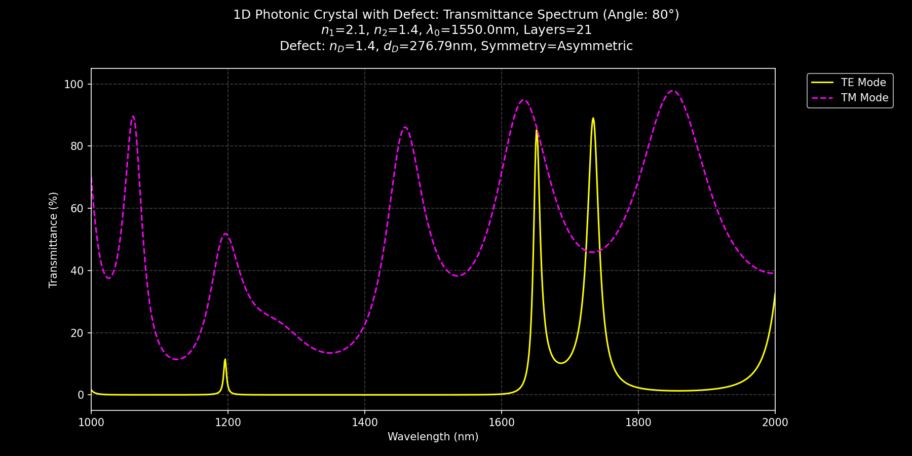

# Spectral Analysis of 1D Photonic Crystals using Transfer Matrix Method (TMM)


## 📖 Overview

This repository contains a comprehensive Jupyter notebook that explores the optical properties of one-dimensional photonic crystals (1D PhCs) using the Transfer Matrix Method (TMM). 1D PhCs, often implemented as Distributed Bragg Reflectors (DBRs), are periodic dielectric structures that manipulate light propagation through interference effects, making them valuable in applications like optical filters, mirrors, and sensors. The project systematically investigates the reflectance and transmittance spectra of 1D PhCs, analyzes the impact of structural parameters, introduces defects to create localized modes, and examines behavior under oblique incidence. The notebook includes detailed simulations, visualizations (plots and animations), and explanations of the underlying physics.

The repository includes:
- A Jupyter notebook (`tmm_1dPhC.ipynb`) with the full analysis.
- Folders for animations (`ANIMATION`), static images (`IMAGES`), and references (`REFERENCES`).
- A `requirements.txt` file to set up the necessary Python environment.

## 🗂️ Table of Contents

- [Spectral Analysis of 1D Photonic Crystals using Transfer Matrix Method (TMM)](#spectral-analysis-of-1d-photonic-crystals-using-transfer-matrix-method-tmm)
  - [📖 Overview](#-overview)
  - [🗂️ Table of Contents](#️-table-of-contents)
  - [🌈 Introduction](#-introduction)
  - [🗃️ Repository Structure](#️-repository-structure)
  - [📚 Notebook Structure](#-notebook-structure)
  - [🚀 Installation](#-installation)
  - [🎮 Usage](#-usage)
  - [🌟 Key Features](#-key-features)
  - [📊 Results and Visualizations](#-results-and-visualizations)
  - [📝 License](#-license)
  - [📚 References](#-references)
  

## 🌈 Introduction

This Jupyter notebook explores the fascinating optical properties of one-dimensional photonic crystals (1D PhCs), which are periodic dielectric structures designed to manipulate light propagation through interference effects. 1D PhCs, often implemented as Distributed Bragg Reflectors (DBRs), are widely used in applications such as optical filters, mirrors, and sensors due to their ability to create photonic bandgaps (PBGs)—wavelength ranges where light propagation is forbidden. By introducing defects or varying structural parameters, these crystals can exhibit tailored optical responses, making them a rich subject for both theoretical and applied studies. In this notebook, we systematically investigate the reflectance and transmittance spectra of 1D PhCs, analyze how their properties depend on various parameters, and examine their behavior under different conditions such as oblique incidence and defect incorporation.


## 🗃️ Repository Structure

```
🗂️ 1D-Photonic-Crystals-TMM-Analysis/  # Root directory
│
├── 🎞️ ANIMATION/              # Folder containing animated visualizations of spectra
├── 🖼️ IMAGES/                 # Folder containing static plots and figures
├── 📚 REFERENCES/             # Folder containing reference material(PDFs papers, etc.)
├── 📓 tmm_1dPhC.ipynb         # Main Jupyter notebook with the analysis
├── 🛠️ requirements.txt        # List of required Python packages
└── 📄 README.md               # This file
```


## 📚 Notebook Structure

The notebook is organized into three main sections, each building on the previous to provide a holistic understanding of 1D PhCs:

1. **1D Photonic Crystal: Fundamentals and Spectra**  
   - **1.1 Calculating and Plotting Reflectance & Transmittance**: Compute and visualize the reflectance and transmittance spectra using TMM, identifying the PBG.  
    
        
    
   - **1.2 Influence of DBR Parameters**:  
     - **1.2.1 Effect of Number of Periods**: Increase the number of periods, observing a sharper PBG, 100% reflectance, and more concentrated side lobes due to enhanced interference.  
        | **Variation in Number of Periods in a grid** | **Variation in Number of Periods within a single plot** |
        |---------------------------------|--------------------------------|
        |||
     - **1.2.2 Effect of Refractive Index Contrast**: Vary the refractive index contrast, noting that higher contrast widens the PBG due to stronger reflections.  

        | **Varying n_H** | **Varying n_L** |
        |---------------------------------|--------------------------------|
        |  |  |

        - The left plot shows the effect of varying the high refractive index (n_H) while keeping the low refractive index (n_L) constant.
        - The right plot illustrates the impact of varying the low refractive index (n_L) while keeping the high refractive index (n_H) constant.
        - Both plots highlight how refractive index contrast influences the photonic bandgap (PBG) width and reflectance.


        
   - **1.3 Animated Evolution of Spectra with Wavelength**: Animate spectral changes across wavelengths, visualizing PBG and side lobe shifts.


        

2. **1D Photonic Crystal with Defect Layers**  
   - **2.1 Symmetric vs Asymmetric Defect Structures**: Compare spectral features of symmetric and asymmetric defects, noting differences in defect mode positions.  
        | **Symmetric Defect** | **Asymmetric Defect** |
        |---------------------------------|--------------------------------|
        |  |  |
   - **2.2 Tuning Defect Layer Parameters**:  
     - **2.2.1 Varying Defect Layer Thickness**: Adjust defect thickness, observing shifts in defect mode wavelength.  
        

        
     - **2.2.2 Varying Defect Layer Refractive Index**: Change the defect’s refractive index, affecting mode position and strength.  

        

     - **2.2.3 Effect of DBR Period Number on Defect Modes**: Increase DBR periods, enhancing defect mode confinement.  
        
   - **2.3 Animating Spectra of Defective Photonic Crystals**: Animate spectral evolution with defects.  
   
        | **Symmetric Defect** | **Asymmetric Defect** |
        |---------------------------------|--------------------------------|
        |  |  |

   - **2.4 Comparing Different Defect Mode Spectra**: Highlight differences between symmetric and asymmetric defect types.
        
3. **1D Photonic Crystal under Oblique Incidence**  
   - **3.1 TE and TM Mode Spectral Analysis**: Analyze TE and TM mode spectra, noting polarization effects like the Brewster angle for TM modes.  
        | **TE Mode** | **TM Mode** |
        |---------------------------------|--------------------------------|
        |  |  |
   - **3.2 Spectral Variation with Angle of Incidence**: Vary the incidence angle, observing PBG shifts and polarization-dependent transmission peaks.  
        
        
        
   - **3.3 Defect Layer Effects under Oblique Incidence**: Study defect modes under oblique incidence.  
   
        | Defect / Modes | Symmetric | Asymmetric |
        |----------------|-----------|------------|
        | **TE** |  |  |
        | **TM** |  |  |

   - **3.4 Angle-Dependent Spectra for Defective Structures**: Examine how defect modes vary with angle and polarization.  

        

   - **3.5 Animated Angular Dependence of TE/TM Spectra**: Animate TE/TM spectral evolution with angle.
        | **Symmetric Defect** | **Asymmetric Defect** |
        |---------------------------------|--------------------------------|
        |  |  |

Each section follows a step-by-step approach: theoretical background, numerical simulations using Python (via TMM), and detailed explanations of trends, supported by visualizations.

## 🚀 Installation

To run the notebook, ensure you have Python 3.8 or higher installed. Follow these steps:

1. **Clone the Repository**:
   ```bash
   git clone https://github.com/PuspenduPH/1D-Photonic-Crystals-Spectra-Analysis-TMM.git
   cd 1D-Photonic-Crystals-Spectra-Analysis-TMM
   ```

2. **Set Up a Virtual Environment** (optional but recommended):
   ```bash
   python -m venv venv
   source venv/bin/activate  # On Windows: venv\Scripts\activate
   ```

3. **Install Dependencies**:
   ```bash
   pip install -r requirements.txt
   ```

   The `requirements.txt` includes packages like `numpy`, `plotly`, and others needed for simulations and visualizations.

4. **Launch Jupyter Notebook**:
   ```bash
   jupyter notebook tmm_1dPhC.ipynb
   ```

## 🎮 Usage

1. Open `tmm_1dPhC.ipynb` in Jupyter Notebook.
2. Run the cells sequentially to execute the simulations and generate plots/animations.
3. Outputs (plots, animations) will be saved in the `IMAGES` and `ANIMATION` folders, respectively.
4. Refer to the `REFERENCES` folder for additional reading materials cited in the notebook.

## 🌟 Key Features

- **Transfer Matrix Method (TMM)**: Implements TMM to calculate reflectance and transmittance spectra of 1D PhCs.
- **Parameter Studies**: Analyzes the effects of period number, refractive index contrast, defect properties, and incidence angle.
- **Defect Modes**: Introduces symmetric and asymmetric defects, exploring their spectral impact.
- **Oblique Incidence**: Examines TE/TM mode behavior under varying angles of incidence.
- **Visualizations**: Includes static plots (saved in `IMAGES`) and animations (saved in `ANIMATION`) for dynamic insights.

## 📊 Results and Visualizations

- **Spectra Plots**: Reflectance and transmittance spectra for various configurations, showing PBGs and defect modes (in `IMAGES`).
- **Animations**: Dynamic visualizations of spectral evolution with wavelength and angle (in `ANIMATION`).
- **Key Findings**:
  - Increasing the number of periods sharpens the PBG and increases reflectance to 100%.
  - Higher refractive index contrast widens the PBG.
  - Defect modes shift with thickness, refractive index, and angle of incidence.
  - TM modes show a peak transmission around 60° due to the Brewster angle effect.


## 📝 License

This project is licensed under the MIT License. See the [LICENSE](LICENSE) file for details.

## 📚 References

Relevant papers, books, and resources are included in the `REFERENCES` folder. Key references cited in Section 4 of the notebook (`tmm_1dPhC.ipynb`) include:

- Sang, Z.-F., & Li, Z.-Y. (2007). Properties of defect modes in one-dimensional photonic crystals containing a graded defect layer. *Optics Communications, 273*(1), 162–166. https://doi.org/10.1016/j.optcom.2006.12.008
- Xifré Pérez, E. (2007). *Design, Fabrication and Characterization of Porous Silicon Multilayer Optical Devices* (Chapter 3: Simulation programs for the analysis of multilayer media). Universitat Rovira i Virgili. ISBN: 978-84-691-0362-3. [https://tdx.cat/handle/10803/8458](https://tdx.cat/handle/10803/8458)
- Joannopoulos, John D., et al. Photonic Crystals: Molding the Flow of Light - Second Edition. REV-Revised, 2, Princeton University Press, 2008. JSTOR, https://doi.org/10.2307/j.ctvcm4gz9. Accessed 15 June 2025.
- Missoni, L. L., Ortiz, G. P., Martínez Ricci, M. L., Toranzos, V. J., & Mochán, W. L. (2020). Rough 1D photonic crystals: A transfer matrix approach. *Optical Materials, 109*, 110012. https://doi.org/10.1016/j.optmat.2020.110012
- Petcu, A., & Preda, L. (2009). The optical transmission of one-dimensional photonic crystal. *Romanian Journal of Physics, 54*(5–6), 539–547. [https://rjp.nipne.ro/2009_54_5-6/0539_0547.pdf](https://rjp.nipne.ro/2009_54_5-6/0539_0547.pdf)


